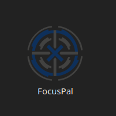
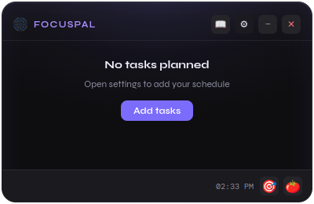
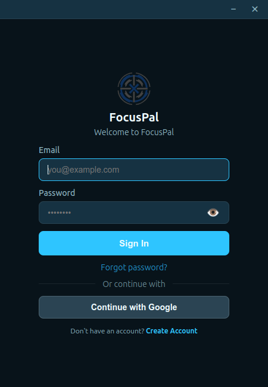
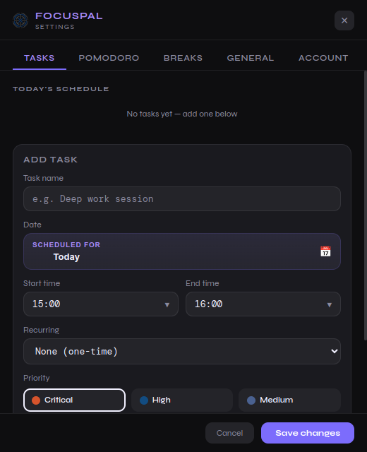
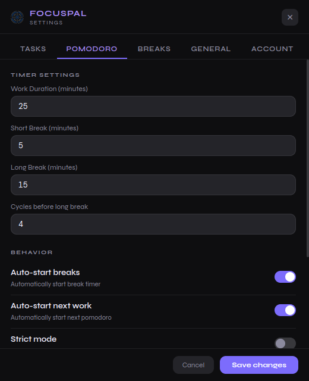
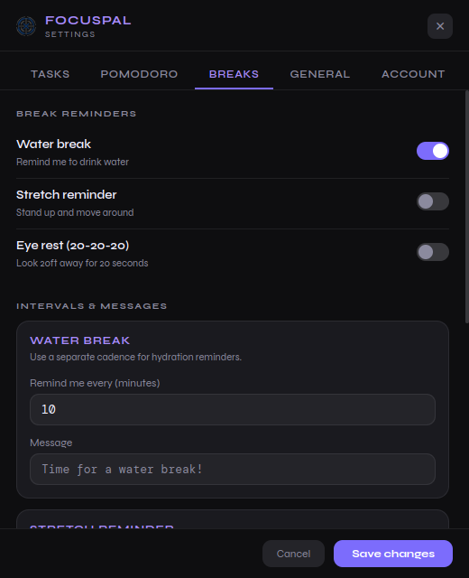
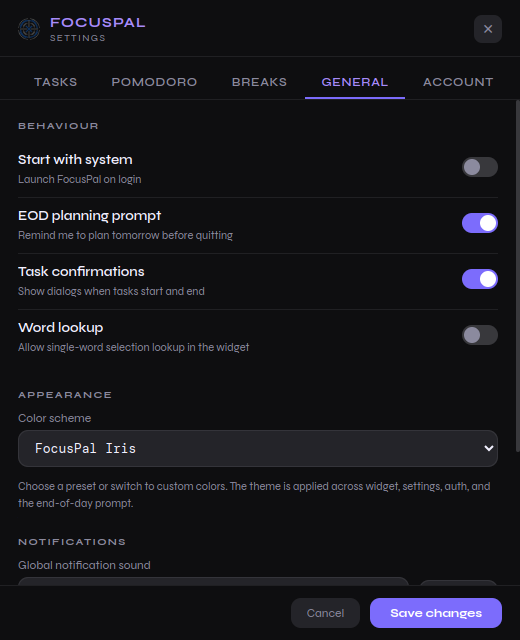
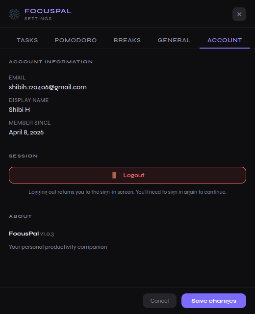
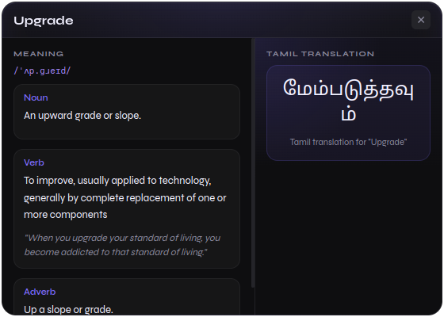

<p align="center">
  
</p>

<h1 align="center">FocusPal</h1>

<p align="center">
  A floating desktop productivity companion for time-blocked task planning,
  focus sessions, break reminders, and quick word lookup.
</p>

<p align="center">
  
</p>

## Overview

FocusPal is an Electron desktop app built around one idea: your schedule should stay visible while you work. Instead of burying tasks in a separate planner window, FocusPal keeps a lightweight floating widget on the desktop, lets you block work by time, and supports the session with Pomodoro timing, break reminders, focus mode, and a built-in word lookup panel.

The app is local-first, with optional authentication and cloud sync through Supabase. If you are offline, FocusPal still works from local storage and continues to restore your tasks, settings, and session state between launches.

> Current platform status: Linux is the primary working release path. Windows packaging exists in the desktop build config, but Windows changes should be developed and tested on a real Windows system so Linux behavior does not regress.

## Screenshot Tour

### Sign-In

FocusPal supports email/password auth and Google sign-in through Supabase.

<p align="center">
  
</p>

### Widget States

The widget can stay as a minimal dot when you want zero clutter, or expand into a larger card for task actions and quick controls.

<table>
  <tr>
    <td align="center">
      
      <br />
      <sub>Collapsed dot mode</sub>
    </td>
    <td align="center">
      
      <br />
      <sub>Expanded widget card</sub>
    </td>
  </tr>
</table>

### Settings Panels

The settings window is where scheduling, behavior, notifications, and account management come together.

<table>
  <tr>
    <td align="center">
      
      <br />
      <sub>Tasks and future scheduling</sub>
    </td>
    <td align="center">
      
      <br />
      <sub>Pomodoro configuration</sub>
    </td>
  </tr>
  <tr>
    <td align="center">
      
      <br />
      <sub>Break reminder controls</sub>
    </td>
    <td align="center">
      
      <br />
      <sub>General behavior and appearance</sub>
    </td>
  </tr>
  <tr>
    <td align="center">
      
      <br />
      <sub>Account info and in-app version display</sub>
    </td>
    <td align="center">
      
      <br />
      <sub>Definition and Tamil translation lookup</sub>
    </td>
  </tr>
</table>

## Download the App Using 

```bash
curl -fsSL https://focuspaldownload.app/focuspal.asc | sudo gpg --dearmor -o /usr/share/keyrings/focuspal.gpg

echo "deb [signed-by=/usr/share/keyrings/focuspal.gpg] https://focuspaldownload.app/apt stable main" | sudo tee /etc/apt/sources.list.d/focuspal.list

sudo apt update 
sudo apt install focuspal
```

## Core Product Flow

FocusPal is designed for a daily loop instead of a one-time checklist:

1. Create time-blocked tasks for today or a future date.
2. Let the widget surface the active task during the day.
3. Use Pomodoro, focus mode, and break reminders while you work.
4. When a task ends, mark it complete or extend it if more time is needed.
5. Keep future tasks visible in the settings schedule so tomorrow's plan is already staged.

This makes the app closer to a lightweight desktop operations layer than a basic to-do list.

## What The App Currently Does

### Floating Desktop Widget

- Always-on-top floating widget for quick visibility.
- Collapsed dot mode for minimal presence.
- Expanded card with task state, clock, and quick actions.
- Settings access directly from the widget.
- Position is remembered between launches.

### Time-Blocked Task Scheduling

- Tasks use explicit start and end times rather than only due dates.
- Each task can be scheduled for today or any future date.
- Recurrence supports one-time, daily, weekdays, and weekends patterns.
- Future-dated tasks appear in a separate scheduled section under the task creation form.
- Task priorities are color-coded for quick scanning.

### End-Of-Task Handling

- The app prompts for task outcome at the end of a block.
- Partial completion can extend the same task by `+5`, `+10`, or `+15` minutes.
- When a task is extended, upcoming tasks are shifted automatically to keep the schedule coherent.
- Resolved tasks are moved into task history instead of disappearing without trace.

### Pomodoro Timer

- Built-in work/break timer inside the widget.
- Configurable work duration, short break, long break, and long-break cycle count.
- Optional auto-start for breaks and next work sessions.
- Strict mode support for more rigid focus sessions.

### Break Reminders

- Independent reminders for water, stretch, and eye rest.
- Separate intervals and messages for each reminder type.
- Notification sound is configurable from settings.

### Focus Mode

- Toggle focus mode from the widget or with `Ctrl + Shift + F`.
- Intended to reduce interruptions while deep work is active.
- Can integrate with Pomodoro behavior and reminder suppression.
- Linux DND integration currently targets GNOME-style notification banner control.

### Word Lookup

- Quick definition lookup for English words.
- Tamil translation panel beside the definition view.
- Lookup behavior can be enabled or disabled from settings.
- Clipboard/selection-driven lookup is supported through the widget flow.

### Themes And Appearance

- Preset themes supported across auth, settings, widget, and prompts.
- Custom theme colors can be edited from the General tab.
- In-app version display is pulled dynamically from the packaged app version.

### Authentication And Sync

- Email/password auth.
- Google OAuth via Supabase PKCE flow.
- Local storage through `electron-store`.
- Cloud sync of tasks, task history, theme, Pomodoro, break settings, and notification preferences.

## Tech Stack

- Electron for the desktop shell and native desktop integration.
- Plain HTML/CSS/JavaScript renderers for widget, auth, and settings windows.
- `electron-store` for local persistence.
- Supabase Auth and PostgREST via a custom client in the Electron main process.
- `electron-builder` for packaging.
- GitHub Actions for CI and Linux release automation.
- Cloudflare R2 for artifact storage and APT repository hosting.

## Project Structure

```text
.
├── README.md
├── package.json
├── pnpm-workspace.yaml
├── docs/
│   ├── *.png
│   └── project-report.md
├── scripts/
│   ├── publish-apt.sh
│   └── purge-cloudflare-cache.sh
└── packages/
    └── desktop/
        ├── assets/
        ├── config/
        ├── electron-builder.yml
        └── src/
            ├── common/
            ├── main/
            └── renderer/
```

Important runtime areas:

- `packages/desktop/src/main/main.js`: Electron windows, tray, IPC, auth, persistence, sync, platform behavior.
- `packages/desktop/src/renderer/widget.js`: floating widget logic, task runtime, prompts, Pomodoro, focus mode, lookup.
- `packages/desktop/src/renderer/settings.js`: scheduling UI, settings persistence, date/time picker, scheduled tasks.
- `packages/desktop/src/main/supabaseClient.js`: auth and cloud sync requests.

## Local Development

### Prerequisites

- Node.js `>= 18`
- pnpm `>= 8`
- Linux desktop environment for the primary current workflow

### Install Dependencies

```bash
pnpm install
```

### Configure Supabase

Copy the example config and fill in your real values:

```bash
cp packages/desktop/config/supabase.example.json packages/desktop/config/supabase.json
```

The config file should contain:

- `url`
- `anonKey`
- `googleAuthRedirectURL`

The default desktop Google callback used by the app is:

```text
http://127.0.0.1:38081/auth/callback
```

### Run The Desktop App

```bash
pnpm dev:desktop
```

### Run Tests

```bash
pnpm --filter @focuspal/desktop test
```

## Build Commands

### Linux

```bash
pnpm build:linux
```

This produces Linux desktop artifacts through `electron-builder`, including:

- AppImage
- `.deb`

### Windows

```bash
pnpm build-win
```

Windows packaging is configured, but practical verification must happen on a Windows machine. Do not treat a cross-built artifact as validated until runtime behavior, installer flow, and platform-specific integrations are checked on Windows.

## Distribution And Release

FocusPal is distributed as a desktop application, not a web app.

Current release infrastructure includes:

- Linux packaging through `electron-builder`
- GitHub Actions CI for desktop tests
- GitHub Actions Linux release pipeline
- Cloudflare R2 artifact hosting
- APT publishing for Debian/Ubuntu-style installation flows

Download base used by the project:

```text
https://focuspaldownload.app
```

Linux artifacts are published under versioned paths such as:

```text
https://focuspaldownload.app/linux/<version>/FocusPal-<version>.AppImage
https://focuspaldownload.app/linux/<version>/FocusPal-<version>.deb
```

## Current Status

The app already has a strong desktop foundation, but it is still in active product and platform hardening.

What is in good shape:

- Core desktop widget workflow
- Task scheduling UI
- Pomodoro and break settings
- Auth flow and local/cloud persistence
- Linux release path and R2-backed distribution

What still needs deliberate work:

- Windows stabilization on a real Windows system
- Broader renderer and integration test coverage
- More modular separation in the large desktop runtime files
- Documentation cleanup for ignored or stale docs

For a deeper engineering status review, see [docs/project-report.md](docs/project-report.md).

## Reference Commands

```bash
pnpm dev:desktop      # run the desktop app in development
pnpm build:desktop    # package the desktop app for the current platform
pnpm build:linux      # build Linux artifacts
pnpm build-win        # build Windows artifacts
pnpm test             # run workspace tests
```
